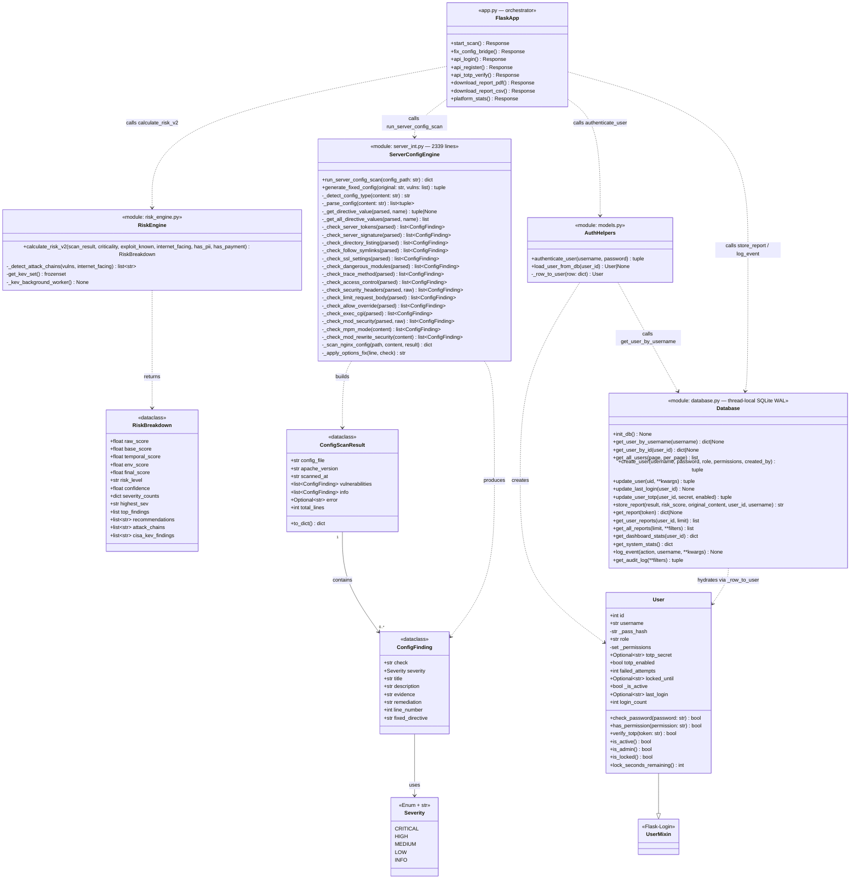

# Class Diagram الصحيح — مبني 100% على الكود الفعلي

## ما يجب حذفه أو تصحيحه من الدياغرام القديم

| الدياغرام القديم | الحقيقة في الكود | القرار |
|---|---|---|
| `class ARIA` | تحذفه أنت — موافق | ✅ محذوف |
| `User.email` | غير موجود في الكود أبداً | ❌ احذفه |
| `User.created_at` | موجود في DB لكن **ليس في User class** | ❌ احذفه من الـ class |
| `RiskBreakdown` غير موجودة | موجودة وأساسية | ✅ أضفها |
| `ConfigFinding` غير موجودة | موجودة في server_int.py | ✅ أضفها |
| `ConfigScanResult` غير موجودة | موجودة في server_int.py | ✅ أضفها |
| `Severity` enum غير موجودة | موجودة | ✅ أضفها |
| علاقة User→ScanReport في الكود | User لا يرى ScanReport مباشرة — يمر عبر database.py | ⚠️ صحح العلاقة |

---

## الدياغرام الصحيح — جاهز للصق في Mermaid

---

## الفروق الجوهرية عن الدياغرام القديم

### 1. User — ما تغيّر
**يُحذف:** `email`, `created_at`  
**يُضاف:** `login_count`, `last_login`, `failed_attempts`, `locked_until`, `totp_secret`, `totp_enabled`  
**يُصحَّح:** `_pass_hash` private (بشرطة سفلية) — `_permissions` private كـ `set` لا `list`  
**يُضاف:** methods `verify_totp()`, `is_locked()`, `lock_seconds_remaining()`

### 2. يُضاف بالكامل
- `RiskBreakdown` dataclass — قلب نظام التقييم
- `ConfigFinding` + `ConfigScanResult` + `Severity` — نظام server_int
- `ServerConfigEngine` — 15+ method الحقيقية
- `Database` module — كل دوال الـ persistence
- `FlaskApp` orchestrator — يوضح كيف ترتبط الكلاسات

### 3. العلاقات الصحيحة
- `User` لا يتصل بـ `ScanReport` مباشرة — `Database.store_report()` تربطهما
- `ServerConfigEngine` تُنتج `ConfigFinding` وليس `Vulnerability` مباشرة
- `RiskEngine` تأخذ dict وترجع `RiskBreakdown` — لا تعرف شيئاً عن `User`

